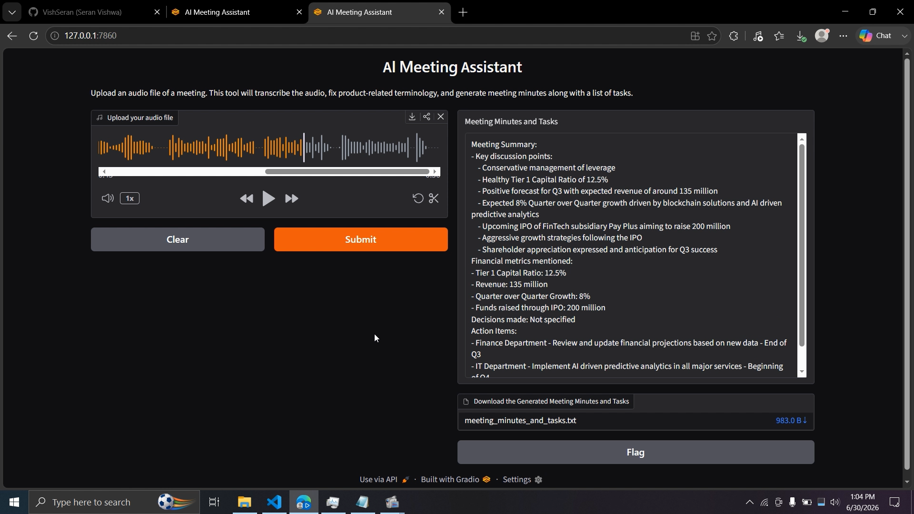

# 🎙️ AI Meeting Assistant: Instant Notes, Zero Worries

An AI-powered meeting companion that transforms audio recordings into structured and actionable meeting notes.

This application combines Speech-to-Text technology with Large Language Models to automate meeting documentation, allowing users to focus on conversations instead of taking notes manually.

---

---

## Features

✔ Speech-to-Text transcription using Whisper

✔ Support for multiple audio formats

✔ Automatic transcript cleaning and formatting

✔ Meeting summarization

✔ Key point extraction

✔ Action item identification

✔ Decision tracking

✔ Deadline extraction

✔ Interactive Gradio interface

✔ LangChain-powered prompt workflows

---

## Technologies Used

- Python
- Gradio
- LangChain
- OpenAI Whisper
- Hugging Face Transformers
- Meta Llama 3.2 Instruct
- IBM watsonx.ai concepts
- PromptTemplate
- Chains
- PyTorch

---

## Project Architecture

Audio Input
↓
Whisper Speech-to-Text
↓
Transcript Preprocessing
↓
LangChain PromptTemplate
↓
Llama 3.2 LLM
↓
Summary Generation
↓
Key Points Extraction
↓
Action Items Identification
↓
Structured Meeting Minutes
↓
Gradio Interface

---

## Application Workflow

### Step 1: Upload Audio

Users upload meeting recordings through the Gradio interface.

Supported formats:

- WAV
- MP3
- M4A
- FLAC

---

### Step 2: Speech Recognition

Whisper converts spoken audio into raw text transcripts.

---

### Step 3: Transcript Processing

The system performs:

- punctuation correction
- formatting
- noise removal
- readability improvements

---

### Step 4: LLM Processing

LangChain PromptTemplate workflows invoke the LLM to generate:

- concise summaries
- discussion highlights
- important decisions
- action items
- deadlines

---

### Step 5: Final Output

Users receive organized meeting minutes including:

## Summary

Brief overview of the meeting.

## Key Discussion Points

Main topics discussed.

## Decisions Made

Important decisions recorded.

## Action Items

Tasks assigned to participants.

## Deadlines

Upcoming due dates.

---

## Installation

Clone the repository:

```bash
git clone https://github.com/username/AI-Meeting-Assistant.git

cd AI-Meeting-Assistant
